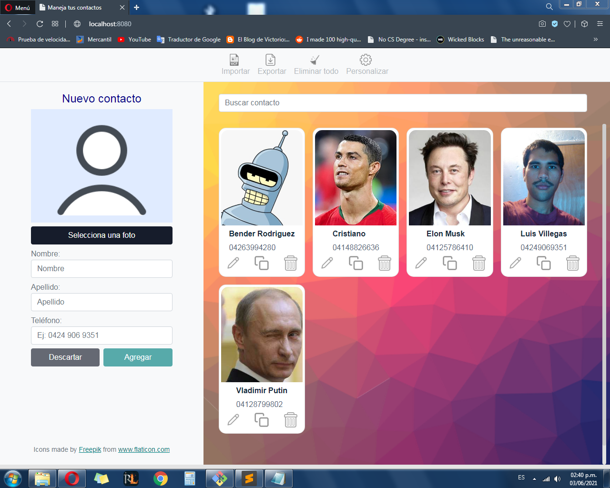

# About

The purpose of this application is to create, read, delete and update contacts. In essence, it is a pretty basic CRUD application that showcases my skills in ReactJS and frontend development.

You can upload a vCard with your contacts from your mobile device and perform the aforementioned actions, or start creating contacts and export them to a vCard which you can then download.

Below is a screenshot of the application running on localhost.

# How to install

1. Run `git clone https://github.com/luisguve/vcards-app.git`
2. Inside the project directory, run `npm install`. This will download all the packages required to build and run the application, which will take a while.

# How to run

In the command line inside the project directory, run the following:

1. `npm start` to start the development server and serve the application on localhost:8080. Make sure that this port is available; e.g. you do not have another application running with webpack server.
2. `npm run build` to build the application. This will export all the files to `dist` folder.
